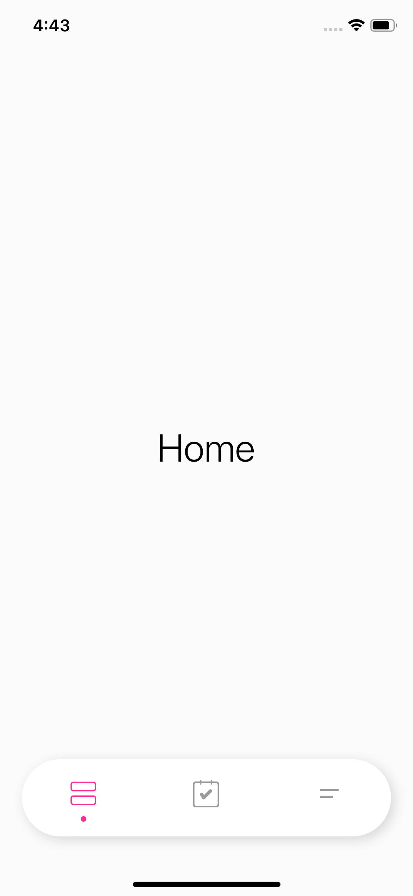
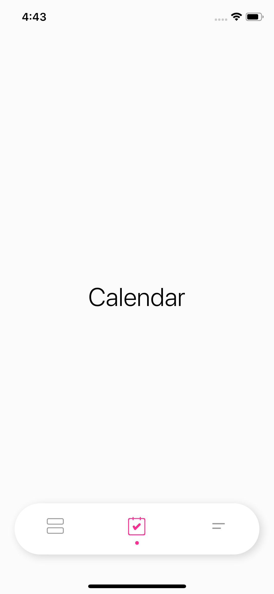

# PTCardTabBar

[](https://travis-ci.org/hussc/PTCardTabBar)
[](https://cocoapods.org/pods/PTCardTabBar)
[](https://cocoapods.org/pods/PTCardTabBar)
[](https://cocoapods.org/pods/PTCardTabBar)


## Screenshots

1             |  2
:-------------------------:|:-------------------------:
  |  

## Example

To run the example project, clone the repo, and run `pod install` from the Example directory first.

## Badges

A badge is set either directly, or through a notification — useful when the code that knows the
count has no reference to the tab bar controller.

```swift
// Direct
cardTabBarController.customTabBar.setBadge(value: 3, at: 0)

// Par notification : les DEUX clés sont obligatoires, un userInfo incomplet est ignoré
// silencieusement. `index` est la position de l'onglet, `value` le compte affiché (0 efface).
NotificationCenter.default.post(
    name: .PTCardTabBarBadgeNotification,
    object: nil,
    userInfo: ["index": 0, "value": 3]
)
```

Les deux valeurs doivent être des `Int`. L'observateur est posé par
`PTCardTabBarController.viewDidLoad`, donc la notification n'a d'effet qu'une fois la vue du
contrôleur chargée.

## Requirements

## Installation

PTCardTabBar is available through [CocoaPods](https://cocoapods.org). To install
it, simply add the following line to your Podfile:

```ruby
pod 'PTCardTabBar'
```

## Author

hussc, hus.sc@aol.com

## License

PTCardTabBar is available under the MIT license. See the LICENSE file for more info.
